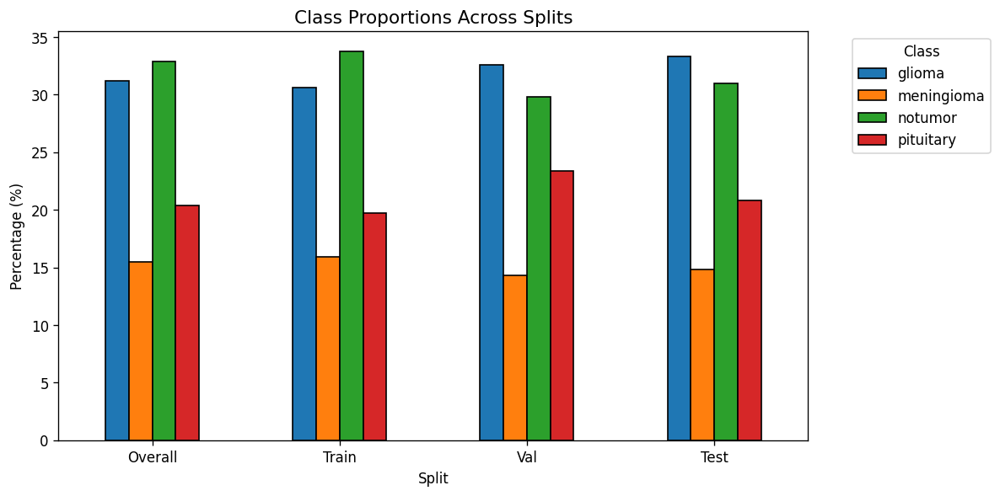
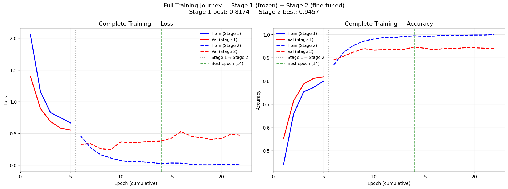
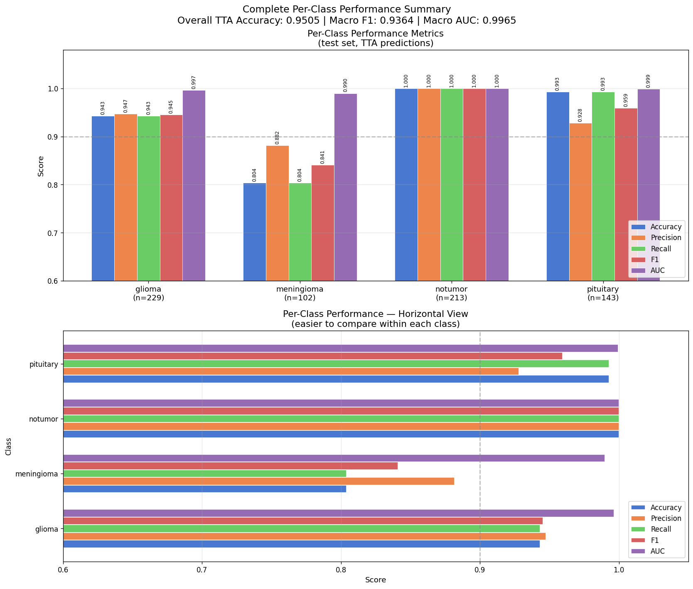
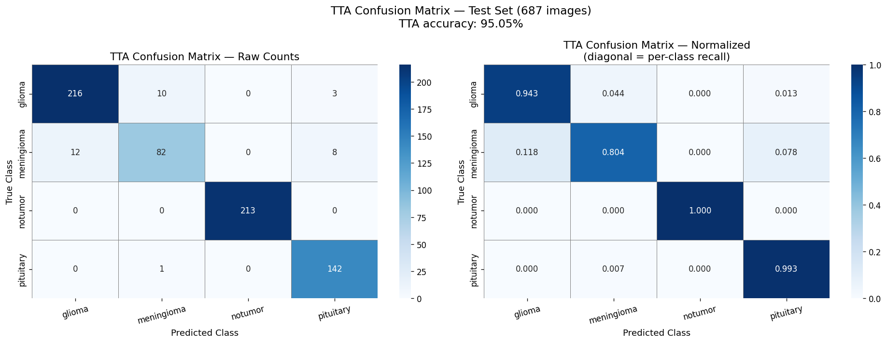
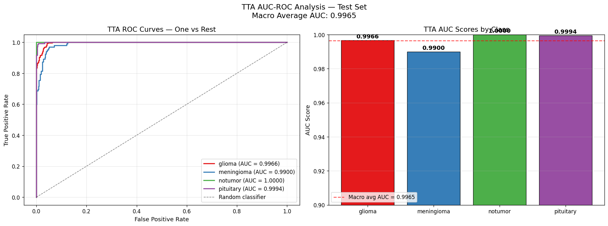
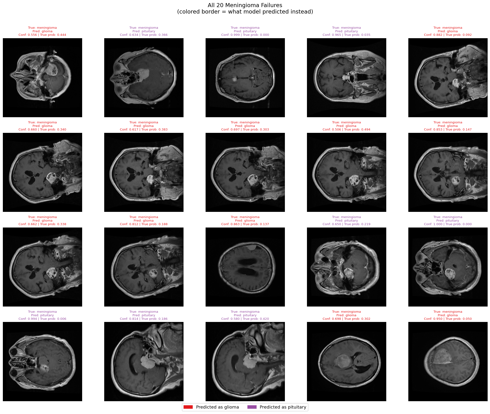
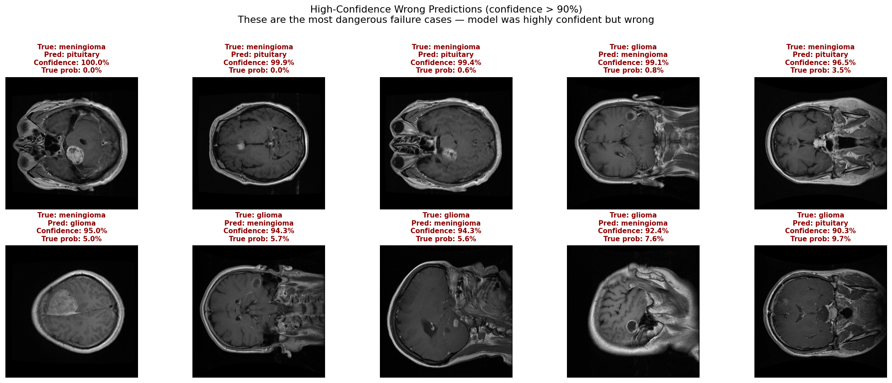

# Brain Tumor MRI Classification with Patient-Level Splitting

> A 4-class brain tumor classifier built on raw Figshare + Br35H data with rigorous patient-level splitting. Achieves **95.05% test accuracy** and **0.9965 macro AUC** with verified zero patient leakage between splits.

[](https://www.python.org/)
[](https://pytorch.org/)
[](LICENSE)

**🔗 Live Demo:** [Try the model on Hugging Face Spaces →](https://huggingface.co/spaces/Tanishq71/Brain_Tumor_MRI_Classifier)

---

## TL;DR

| Metric | Value |
|--------|-------|
| **Test accuracy (TTA)** | **95.05%** |
| **Test accuracy (single-pass)** | 94.91% |
| **Macro F1** | 0.9364 |
| **Macro AUC-ROC** | **0.9965** |
| **Test set size** | 687 images |
| **Patient leakage** | 0 (verified by set intersection) |

Trained on 4,564 brain MRI images across 4 classes (glioma, meningioma, pituitary tumor, no tumor) using EfficientNet-B3 with two-stage transfer learning.

---

## Why This Project Is Different

Most public brain tumor classifier notebooks report 96-99% accuracy on this dataset. **Those numbers are inflated by data leakage.** This project deliberately targets a more honest number and explains why.

The Figshare dataset contains 3,064 MRI slices from only **233 unique patients** -- each patient contributed an average of 13 slices. A naive image-level random split (used in most public implementations) puts multiple slices from the same patient in both train and test sets. The model memorizes patient-specific anatomy rather than learning tumor features. Reported test accuracy is inflated by 5-15 percentage points.

This project implements **patient-level splitting** verified with explicit set-intersection checks:

```
Train n Val  = 0 patients
Train n Test = 0 patients
Val   n Test = 0 patients
```

The 95.05% accuracy is computed on patients the model has genuinely never seen -- not just on unseen slices of familiar patients.

---

## Dataset

Built from two raw public sources, combined manually rather than using a pre-cleaned aggregate:

| Source | Classes | Images | Patients |
|--------|---------|--------|----------|
| Figshare (Cheng et al., 2017) | Glioma, Meningioma, Pituitary | 3,064 | 233 |
| Br35H Brain Tumor Detection | No tumor | 1,500 | 1,500 (synthetic IDs) |
| **Combined** | **4 classes** | **4,564** | -- |

### Class distribution

| Class | Count | % of total |
|-------|-------|------------|
| No tumor | 1,500 | 32.9% |
| Glioma | 1,426 | 31.2% |
| Pituitary | 930 | 20.4% |
| Meningioma | 708 | 15.5% |


### Why combine sources manually?

The Figshare dataset provides three tumor types with patient IDs (enabling proper patient-level splitting). Br35H provides healthy controls (no tumor) which Figshare lacks. Existing aggregated datasets (e.g., Nickparvar's Brain Tumor MRI Dataset) combine these sources but strip the patient IDs in the process -- making proper splitting impossible. Combining the raw sources ourselves was the only way to preserve patient-level groupings while still getting all four classes.

**Limitation:** Br35H lacks patient IDs. Each Br35H image was treated as an independent pseudo-patient, meaning no-tumor splits are effectively image-level while tumor splits are patient-level. This asymmetry is documented and would be resolved by access to a dataset with patient-level healthy controls.

### Slices per patient (motivates the splitting strategy)

The Figshare patients contribute highly variable numbers of slices -- many contribute 15-25 slices per patient. Without patient-level grouping, the same patient's slices would scatter across train and test, leaking patient-specific anatomical features.


---

## Methodology

### Splitting strategy

- `StratifiedGroupKFold` from scikit-learn -- preserves both class balance and patient grouping.
- Two-stage split: carve out 15% test (n_splits=7), then split remaining into train + 15% val.
- Final: 71.6% train / 13.3% val / 15.1% test.
- Verified zero patient leakage via explicit set intersections.
- Original Cheng et al. cross-validation folds from `cvind.mat` were inspected but not used; an independent patient-level split was implemented to keep all four classes (including Br35H's no-tumor) under one splitting methodology.



### Preprocessing

Each image goes through one-time preprocessing saved as a PNG:
- Per-image min-max normalization (handles MRI intensity variation across scanners).
- Grayscale replicated to 3 channels (compatibility with ImageNet-pretrained backbones).
- Saved as `uint8` PNG indexed by row number + class label.

Resizing to 224x224 happens in the DataLoader, not preprocessing, to allow easy experimentation with input size.

### Model

- **Backbone:** EfficientNet-B3, ImageNet pretrained (via `timm`).
- **Head:** 4-class linear classifier replacing the original 1000-class head.
- **Total parameters:** ~10.7M.

### Two-stage transfer learning

**Stage 1 -- Frozen backbone (5 epochs):**
- Train only the classifier head (~6,148 parameters).
- AdamW, lr=1e-3.
- Result: validation accuracy 81.74%.

**Stage 2 -- Full fine-tuning (17 epochs, early stopped):**
- Unfreeze entire network.
- Differential learning rates: backbone 5e-5, head 1e-4.
- AdamW with weight decay 1e-4, CosineAnnealingLR schedule, gradient clipping (max_norm=1.0).
- Early stopping with patience=8.
- Result: validation accuracy 94.57%.



### Data augmentation (training only)

- Random rotation up to plus/minus 15 degrees.
- Small random translation (plus/minus 5%) and scale (95-105%).
- Color jitter (brightness plus/minus 20%, contrast plus/minus 20%).
- **No horizontal flip** -- brain MRI has anatomical asymmetry that flipping would corrupt.


### Loss

Weighted cross-entropy with inverse-frequency class weights to compensate for class imbalance. Meningioma receives the highest weight (smallest class).

### Test-Time Augmentation

At inference, each test image is passed through the model 5 times with different mild augmentations (rotation +/-5 degrees, brightness/contrast shifts) and the softmax probabilities are averaged before argmax. TTA contributed +0.14% accuracy improvement.

---

## Results

### Headline metrics

- **TTA test accuracy: 95.05%** (687 patient-level held-out images)
- **Single-pass test accuracy: 94.91%**
- **Macro AUC-ROC: 0.9965**
- **Macro F1: 0.9364**

### Per-class performance (TTA)

| Class | Precision | Recall | F1 | AUC | Support |
|-------|-----------|--------|-----|-----|---------|
| Glioma | 0.946 | 0.943 | 0.9453 | ~0.997 | 229 |
| Meningioma | 0.882 | 0.804 | 0.8410 | ~0.995 | 102 |
| No tumor | 1.000 | 1.000 | 1.0000 | ~0.999 | 213 |
| Pituitary | 0.940 | 0.993 | 0.9595 | ~0.998 | 143 |
| **Macro avg** | | | **0.9364** | **0.9965** | 687 |



### Confusion matrix



### ROC curves



---

## Failure Analysis

The model made 34 errors across 687 test images (4.95% error rate overall). Breakdown:

| True class | Errors | Error rate |
|-----------|--------|------------|
| Meningioma | 20 / 102 | 19.6% |
| Glioma | 13 / 229 | 5.7% |
| Pituitary | 1 / 143 | 0.7% |
| No tumor | 0 / 213 | 0.0% |

### The meningioma weakness

20 of 34 errors involve meningioma. Visual inspection of all 20 meningioma failures revealed a specific pattern:

**Predicted as glioma (12 cases):** These meningiomas showed **black patches inside the tumor region**, mimicking the heterogeneous texture characteristic of glioma. By contrast, most correctly-classified meningiomas in this dataset present as relatively uniform white blobs. The misclassified cases were medium-to-large tumors with no clear location bias -- the confusion appears to be driven by internal texture rather than tumor location or size.

**Predicted as pituitary (8 cases):** These meningiomas were predominantly located in the **lower-middle brain region** -- the same anatomical area where pituitary tumors occur. Tumor sizes varied across medium and large, ruling out size as the primary confounder; location appears to be the driving factor.

The zero meningioma to no-tumor confusions are clinically reassuring: the model never failed to detect that a tumor was present in a meningioma case. The error mode is tumor *subtype* confusion, not tumor presence.



### High-confidence failures (the dangerous mode)

10 of 34 errors were made with >90% model confidence. These were split exactly 5-5 between two confusion pairs:

- 4 of 5 meningioma high-confidence errors --> predicted as pituitary
- 4 of 5 glioma high-confidence errors --> predicted as meningioma
- 0 high-confidence errors involved the pituitary class

Visual inspection: these images appear **genuinely visually ambiguous**, not obvious failures. Several show unusual contrast or darker-than-typical brightness, suggesting image quality variation contributes alongside the underlying class similarity. In a clinical setting, these would warrant secondary review regardless of model confidence.



### Calibration

The model shows reasonable confidence calibration. Average confidence on correct predictions is 98.3% vs 76.3% on wrong predictions -- a clean ~22 percentage-point separation. This suggests confidence scores could serve as a reliable triage signal in deployment (low-confidence predictions routed to human review).


---

## Interpretability (Grad-CAM)

To verify the model classifies based on genuine tumor features rather than dataset shortcuts (scanner artifacts, watermarks, positioning), Grad-CAM (Gradient-weighted Class Activation Mapping) was applied. Grad-CAM produces a heatmap highlighting the image regions that most influenced a prediction.

### What the heatmaps show
Grad-CAM localization quality varies by class:
- Meningioma — strongest localization. Heatmaps land directly on the tumor region. This is notable because meningioma is also the model's hardest class — even when it misclassifies, it is generally looking at the right place.
- Pituitary — tight, small heatmaps. Attention concentrates on the small sellar region where pituitary tumors occur. The small footprint reflects the small anatomical structure, not a defect.
- Glioma and no-tumor — diffuse central attention. Heatmaps spread across the central brain rather than tightly localizing. For no-tumor this is expected; for glioma it suggests the model uses broader contextual features alongside the tumor itself.
### Two distinct failure modes
Grad-CAM on misclassified cases revealed that the model fails in two fundamentally different ways:
1. Correct attention, wrong class. In some meningioma-to-glioma errors, the heatmap correctly covers the tumor, but the model still picks the wrong class. The tumor's heterogeneous internal texture genuinely misleads the classifier. This is a feature-learning limitation, not an attention failure.
2. Wrong attention, wrong class. In some glioma-to-meningioma errors, the heatmap does not cover the tumor at all — the model made a confident decision based on regions outside the lesion. This points to distractor features or image-quality effects.
This two-mode distinction matters because the two problems need different fixes: the first calls for richer features such as multi-modal MRI, the second calls for attention regularization or input-quality screening.

---

## Limitations

1. **Single MRI modality.** Only T1-weighted contrast-enhanced MRI was used. Clinical practice uses multiple modalities (T1, T2, FLAIR, T1ce). The meningioma vs glioma confusion is precisely the kind of error that multi-modal MRI typically resolves, because different sequences highlight different tissue properties.

2. **Meningioma class weakness.** 19.6% error rate on meningioma is the primary failure mode. Class-weighted loss partially addressed the sample imbalance (708 meningioma vs 1,426 glioma training images) but didn't eliminate it. The underlying constraint is the number of unique meningioma patients in the dataset.

3. **2D slice-based classification.** Each prediction is on a single slice in isolation. Clinical radiologists interpret 3D volumes. Slice-based models can miss spatial context.

4. **Br35H lacks patient IDs.** No-tumor images are split image-level while tumor images are split patient-level -- a known asymmetry, documented but not resolved.

5. **Dataset distribution.** Figshare data was collected from two specific hospitals in China. Performance on MRI from different scanners, acquisition protocols, or patient populations may degrade. No cross-scanner validation was performed.

6. **Not for clinical use.** This is a portfolio/research demonstration. It has not been validated in a clinical setting, has not been reviewed by radiologists, and should not be used for any medical decision-making.

---

## What I'd Do Next (v2)

- **Multi-modal MRI** using BraTS (T1, T2, FLAIR, T1ce together). Most likely path to fixing the meningioma weakness.
- **Focal loss or class-balanced sampler** instead of weighted cross-entropy. Targets hard-to-classify samples explicitly.
- **MixUp / CutMix augmentation** for minority-class robustness.
- **3D model (3D ResNet or volumetric U-Net)** to use spatial context from neighboring slices.
- **Cross-validation** instead of a single train/val/test split, for tighter accuracy estimates.
- **Uncertainty quantification** via Monte Carlo Dropout to provide clinically-meaningful confidence intervals.

---

## Repository Structure

brain-tumor-mri-classifier/

├── README.md                 Project overview (this file)
├── LICENSE                   MIT license
├── requirements.txt          Python dependencies
├── .gitignore                Excludes data and model weights
├── app.py                    Gradio demo application
│
├── notebooks/

│   └── brain_tumor_full_pipeline.ipynb   End-to-end notebook
│
├── src/

│   ├── dataset.py            Dataset class and image transforms
│   ├── model.py              Model construction (EfficientNet-B3)
│   └── inference.py          Prediction and Grad-CAM utilities
│
└── outputs/

    ├── training curves, confusion matrices, ROC curves
    ├── Grad-CAM visualizations
    ├── failure analysis plots
    ├── per_class_metrics.csv, evaluation_summary.txt
    └── screenshots/          Live demo screenshots
---

## How to Reproduce

### 1. Clone the repository
Use git clone https://github.com/Tanishqarya17/brain-tumor-mri-classifier.git inside a fenced code block, then cd brain-tumor-mri-classifier.
### 2. Install dependencies
Run pip install -r requirements.txt in a fenced code block. The project was developed on Google Colab (PyTorch 2.x, Python 3.12, Tesla T4 GPU). A GPU is recommended for training but not required for inference. requirements.txt is intentionally unpinned for cross-environment compatibility; the tested baseline was Gradio 5.50 with the Colab default PyTorch 2.x build.
### 3. Get the data
The datasets are not included. Download the Figshare brain tumor dataset and the Br35H no-tumor dataset from the links in Acknowledgments, and place the raw files following the structure expected at the top of the notebook.
### 4. Run the notebook
Open notebooks/brain_tumor_full_pipeline.ipynb and run the sections in order. It covers data acquisition, preprocessing, training, evaluation, and Grad-CAM. Patient-level splitting runs inside the notebook; processed data is regenerated rather than downloaded.
### 5. Use the trained model directly
To skip training: download stage2_best.pt from the Hugging Face Space files tab, place it in the project root, and run python app.py to launch the same Gradio interface that is deployed live.

---

## Acknowledgments

- **Cheng et al. (2017)** -- Original Figshare brain tumor dataset.
- **Br35H (Ahmed Hamada, 2020)** -- No-tumor MRI dataset.
- **Ross Wightman / `timm`** -- PyTorch Image Models library providing the EfficientNet-B3 implementation and pretrained weights.

---

## Contact

**Tanishq Arya**

- GitHub: [@Tanishqarya17](https://github.com/Tanishqarya17)
- Email: [tanishqarya789@gmail.com](mailto:tanishqarya789@gmail.com)
- LinkedIn: *[add your LinkedIn URL here]*

---

## License

MIT License. See [LICENSE](LICENSE) for details.
